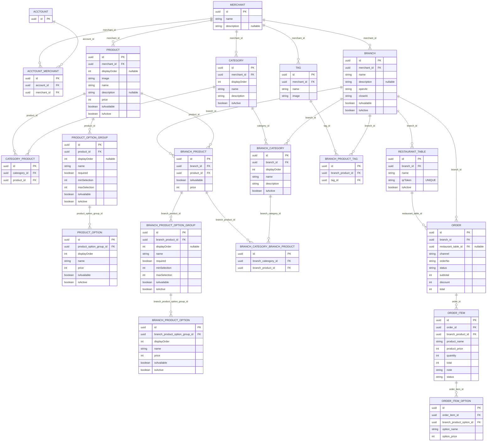

```mermaid
erDiagram
    ACCTOUNT ||--o{ ACCTOUNT_MERCHANT : account_id
    MERCHANT ||--o{ ACCTOUNT_MERCHANT : merchant_id
    MERCHANT ||--o{ TAG : merchant_id
    MERCHANT ||--o{ BRANCH : merchant_id
    MERCHANT ||--o{ PRODUCT : merchant_id
    MERCHANT ||--o{ CATEGORY : merchant_id
    CATEGORY ||--o{ CATEGORY_PRODUCT : category_id
    PRODUCT ||--o{ CATEGORY_PRODUCT : product_id
    PRODUCT ||--o{ PRODUCT_OPTION_GROUP : product_id
    PRODUCT_OPTION_GROUP ||--o{ PRODUCT_OPTION : product_option_group_id
    PRODUCT ||--o{ BRANCH_PRODUCT : product_id
    BRANCH ||--o{ BRANCH_PRODUCT : branch_id
    BRANCH_PRODUCT ||--o{ BRANCH_PRODUCT_OPTION_GROUP : branch_product_id
    BRANCH_PRODUCT_OPTION_GROUP ||--o{ BRANCH_PRODUCT_OPTION : branch_product_option_group_id
    BRANCH ||--o{ RESTAURANT_TABLE : branch_id
    BRANCH ||--o{ BRANCH_PRODUCT_TAG : branch_id
    BRANCH ||--o{ BRANCH_CATEGORY : branch_id
    CATEGORY ||--o{ BRANCH_CATEGORY : category_id
    BRANCH_CATEGORY ||--o{ BRANCH_CATEGORY_BRANCH_PRODUCT : branch_category_id
    BRANCH_PRODUCT ||--o{ BRANCH_CATEGORY_BRANCH_PRODUCT : branch_product_id
    TAG ||--o{ BRANCH_PRODUCT_TAG : tag_id
    BRANCH ||--o{ ORDER : branch_id
    RESTAURANT_TABLE ||--o{ ORDER : restaurant_table_id
    ORDER ||--o{ ORDER_ITEM : order_id
    ORDER_ITEM ||--o{ ORDER_ITEM_OPTION : order_item_id

    ACCTOUNT {
        uuid id PK
    }
    ACCTOUNT_MERCHANT {
        uuid id PK
        uuid account_id FK
        uuid merchant_id FK
    }
    MERCHANT {
        uuid id PK
        string name
        string description "nullable"
    }
    BRANCH {
        uuid id PK
        uuid merchant_id FK
        string name
        string description "nullable"
        string openAt
        string closeAt
        boolean isAvailable
        boolean isActive
    }
    RESTAURANT_TABLE {
        uuid id PK
        uuid branch_id FK
        string name
        string qrToken "UNIQUE"
        boolean isActive
    }
    TAG {
        uuid id PK
        uuid merchant_id FK
        string name
        string image
    }
    BRANCH_PRODUCT_TAG {
        uuid id PK
        uuid branch_product_id FK
        uuid tag_id FK
    }
    PRODUCT {
        uuid id PK
        uuid merchant_id FK
        int displayOrder "nullable"
        string image
        string name
        string description "nullable"
        int price
        boolean isAvailable
        boolean isActive
    }
    PRODUCT_OPTION_GROUP {
        uuid id PK
        uuid product_id FK
        int displayOrder "nullable"
        string name
        boolean required
        int minSelection
        int maxSelection
        boolean isAvailable
        boolean isActive
    }
    PRODUCT_OPTION {
        uuid id PK
        uuid product_option_group_id FK
        int displayOrder
        string name
        int price
        boolean isAvailable
        boolean isActive
    }
    BRANCH_PRODUCT {
        uuid id PK
        uuid branch_id FK
        uuid product_id FK
        boolean isAvailable
        int price
    }
    BRANCH_PRODUCT_OPTION_GROUP {
        uuid id PK
        uuid branch_product_id FK
        int displayOrder "nullable"
        string name
        boolean required
        int minSelection
        int maxSelection
        boolean isAvailable
        boolean isActive
    }
    BRANCH_PRODUCT_OPTION {
        uuid id PK
        uuid branch_product_option_group_id FK
        int displayOrder
        string name
        int price
        boolean isAvailable
        boolean isActive
    }
    CATEGORY {
        uuid id PK
        uuid merchant_id FK
        int displayOrder
        string name
        string description
        boolean isActive
    }
    CATEGORY_PRODUCT {
        uuid id PK
        uuid cateogory_id FK
        uuid product_id FK
    }
    BRANCH_CATEGORY {
        uuid id PK
        uuid branch_id FK
        int displayOrder
        string name
        string description
        boolean isActive
    }
    BRANCH_CATEGORY_BRANCH_PRODUCT {
        uuid id PK
        uuid branch_cateogory_id FK
        uuid branch_product_id FK
    }
    ORDER {
        uuid id PK
        uuid branch_id FK
        uuid restaurant_table_id FK "nullable"
        string channel
        string orderNo
        string status
        int subtotal
        int discount
        int total
    }
    ORDER_ITEM {
        uuid id PK
        uuid order_id FK
        uuid branch_product_id FK
        string product_name
        int product_price
        int quantity
        int total
        string note
        string status
    }
    ORDER_ITEM_OPTION {
        uuid id PK
        uuid order_item_id FK
        uuid branch_product_option_id FK
        string option_name
        int option_price
    }
```
